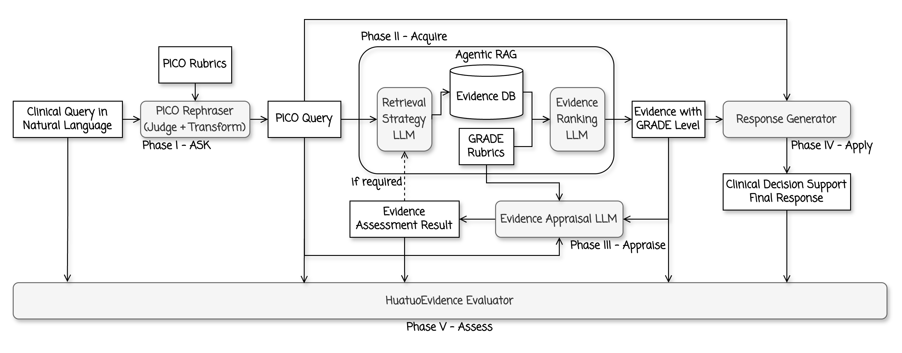
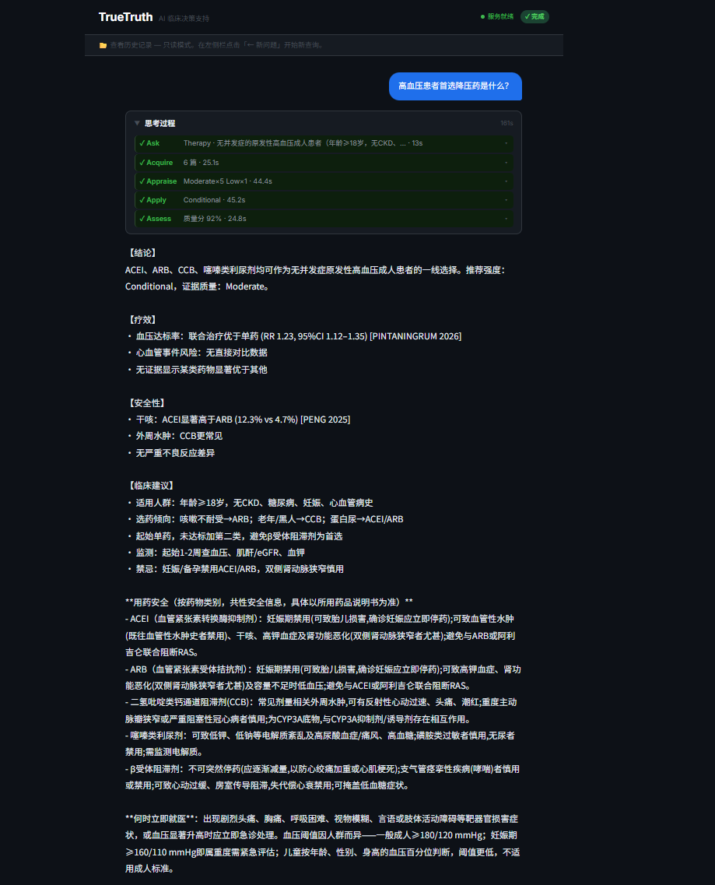

<div align="center">

# TrueTruth

**循证医学临床决策支持系统**

[](https://www.python.org/downloads/)
[](https://opensource.org/licenses/MIT)
[](https://platform.openai.com/)

</div>

> [!CAUTION]
> **仅供科研与教育用途——本系统不是医疗器械**
>
> EBM 5A 是实验性研究工具，未经任何监管机构批准为医疗器械。系统输出**不能替代**持证医疗专业人员的临床判断。任何推荐在用于临床决策前，**必须**由具备资质的临床医生独立审查。作者对依赖本系统输出所导致的任何患者伤害**不承担任何责任**。

---

## 项目简介

TrueTruth 将一段普通的临床问题文本全自动转化为**经过分级的、可独立核实的**临床推荐。

系统实现国际通行的**循证医学 5A 框架**（Ask → Acquire → Appraise → Apply → Assess），以多智能体流水线 + **ReAct 控制循环**驱动，配合内置的高血压证据向量库（Hypertension RAG）提供结构化证据检索。

### 系统架构



> 临床问题经 **Ask**（PICO 重写）→ **Acquire**（Agentic RAG 证据检索）→ **Appraise**（GRADE 证据评价）→ **Apply**（推荐生成）四阶段流转，全程由 **Assess**（HuatuoEvidence Evaluator）质量评估并在必要时回溯。

---

<!-- 演示视频（待补充）：
  视频上传方式：在任意 GitHub issue / release 编辑框中直接拖入 .mp4，
  GitHub 会生成 https://github.com/user-attachments/assets/... 链接，
  将该裸链接单独成行粘贴到下方即可自动渲染为内嵌播放器。补好后取消本段注释。

## 演示

VIDEO_URL_HERE

-->

## 界面预览



> Web 界面（http://localhost:8080）：左侧 5A 流水线实时进度，右侧分级临床推荐与用药安全的流式输出。

---

## 快速开始（3 步）

### 前提条件

- [Docker Desktop](https://www.docker.com/products/docker-desktop/) 已安装并运行
- 一个 OpenAI 兼容的 LLM API Key
- 一个[智谱 API Key](https://open.bigmodel.cn/)（用于证据库检索的 Embedding）

**系统要求**

| 资源 | 最低 | 建议 |
|------|------|------|
| 内存 | 8 GB | 16 GB |
| 磁盘 | 6 GB 可用（预置证据库镜像 ~500MB + 依赖镜像） | 10 GB |
| 网络 | 可访问 LLM / 智谱 / PubMed API | — |

### 部署步骤

```bash
# 1. 克隆项目
git clone https://github.com/FreedomIntelligence/TrueTruth.git
cd TrueTruth

# 2. 配置环境变量
cp .env.example .env
# 编辑 .env，填写以下必填项：
#   LLM_API_KEY      — 你的 LLM API Key
#   LLM_BASE_URL     — LLM API 地址
#   LLM_MODEL        — 模型名称
#   ZHIPU_API_KEY    — 智谱 API Key（用于证据库 Embedding）
#   PUBMED_EMAIL     — 你的邮箱（PubMed API 要求）

# 3. 一键启动
docker compose up
# 首次启动会自动拉取预置证据库镜像（~500MB），约需 3–5 分钟
# 浏览器打开 http://localhost:8080
```

> 停止服务：`docker compose down`

### Docker 会启动以下服务

| 服务 | 说明 | 端口 |
|------|------|------|
| `qdrant` | 向量数据库（预置高血压证据数据） | 6333 |
| `hypertensiondb` | 证据检索 API | 8000（内部） |
| `backend` | EBM 5A 主服务（FastAPI） | 8000（内部） |
| `frontend` | Web 界面（Nginx） | **8080** |

---

## 手动运行（不使用 Docker）

适合需要修改代码或调试的开发者。

### 1. 安装依赖

```bash
# 主项目
pip install -r requirements.txt -r requirements-web.txt

# 证据库服务
cd hypertension
pip install -e .
cd ..
```

### 2. 启动 Qdrant

```bash
cd hypertension
docker compose up -d    # 仅启动 Qdrant 容器
cd ..
```

> 如果是首次使用，需要构建索引：`cd hypertension && hdb index rebuild --confirm`
> 这需要智谱 API Key 并耗时约 5–10 分钟。

### 3. 启动服务

```bash
# 终端 1：启动证据库 API
cd hypertension && hdb serve run --port 8000

# 终端 2：启动主后端
make dev-backend

# 终端 3：启动前端
make dev-frontend
```

或使用 CLI 模式：
```bash
python src/main.py "68岁男性，高血压合并糖尿病，ACEI还是ARB？"
```

---

## 配置说明

所有配置在 `.env` 文件中，详见 `.env.example` 的注释。

| 变量 | 必填 | 说明 |
|------|------|------|
| `LLM_BASE_URL` | ✅ | LLM API 地址 |
| `LLM_API_KEY` | ✅ | LLM API Key |
| `LLM_MODEL` | ✅ | 模型名称 |
| `PUBMED_EMAIL` | ✅ | PubMed API 要求的邮箱 |
| `ZHIPU_API_KEY` | ✅ | 智谱 Embedding API Key（证据库检索） |
| `FAST_LLM_MODEL` | ❌ | Judge/Scheduling 用更快的模型，节省 ~30–40% 耗时 |

---

## 示例输出

输入：`68岁男性，高血压合并2型糖尿病，降压首选ACEI还是ARB？`

```
[Ask]      问题解析完成  (route=full_pipeline, type=Therapy)
[Acquire]  检索到 3 篇文献
[Appraise] 证据质量评价完成  (3 篇)
[Apply]    推荐生成完成  (strength=Conditional, quality=Moderate)
[Assess]   质量评估完成  score=0.79  backtrack=False

★ 临床答案 ──────────────────────────────────────────────
A: 在无严重蛋白尿或肾功能不全（eGFR>60）的患者中，ACEI 与 ARB 在心血管事件、
   肾功能恶化、血糖控制和不良反应方面无显著差异，两者均可作为一线选择。
   优先 ARB（如缬沙坦）以避免干咳；合并蛋白尿>300mg/24h 时优先 ACEI。

   推荐强度  : Conditional
   证据质量  : Moderate
   质量评分  : 0.79 / 1.0
   参考文献  : [1] Cho M, et al. Scientific Reports. 2023.
              [2] 依那普利说明书  [3] 缬沙坦说明书
```

> 完整输出还包含用药安全（禁忌/警告/相互作用/监测/妊娠）、Outcome 覆盖度、证据缺口与「何时立即就医」提示。

---

## 项目结构

```
TrueTruth/
├── src/                              # 核心多智能体引擎
│   ├── main.py                       # CLI 入口
│   ├── agents/                       # 5A 各阶段 Agent
│   ├── coordinator/                  # ReAct 主循环 + 安全门控
│   ├── judge/                        # Judge LLM 评分
│   ├── scheduling/                   # Scheduling LLM 决策
│   ├── tools/                        # RAG 客户端
│   └── config/                       # LLM 配置 + 提示词
│
├── web/                              # Web 界面
│   ├── backend/                      # FastAPI + SSE
│   └── frontend/                     # React + Vite
│
├── hypertension/                     # 高血压证据库子项目
│   ├── evidence/                     # 证据源文件（.md）
│   ├── src/hypertensiondb/           # 检索服务代码
│   ├── Dockerfile                    # 证据库 API 镜像
│   └── docker-compose.yml            # 单独启动 Qdrant 用
│
├── docker-compose.yml                # 统一部署（4 个服务）
├── Dockerfile.backend                # 主后端镜像
├── Dockerfile.frontend               # 前端镜像
├── Dockerfile.qdrant                 # 预置数据的 Qdrant 镜像
├── .env.example                      # 配置模板
└── Makefile                          # 常用命令
```

---

## 常用命令

```bash
make dev-backend    # 启动后端（热重载）
make dev-frontend   # 启动前端开发服务器
make dev            # 前后端同时启动
make lint           # 代码检查
make format         # 自动格式化
make cli QUERY="..."  # CLI 运行查询
```

---

## 维护者：更新证据库

当你修改了 `hypertension/evidence/` 中的证据文件后：

```bash
# 重建 Qdrant 索引（需智谱 API Key，耗时约 5–10 分钟）
cd hypertension
hdb index rebuild --confirm
```

重建后即可在本地使用最新证据数据。

---

## 故障排查

| 现象 | 可能原因与解决 |
|------|----------------|
| `docker compose up` 报连接失败 | Docker Desktop 未启动；启动后重试 |
| Acquire 阶段检索为空 / 报 RAG 不可用 | Qdrant 或证据库 API 未就绪；确认 6333 端口可访问，必要时 `hdb index rebuild --confirm` 重建索引 |
| 启动报 API 401 / 鉴权失败 | `.env` 中 `LLM_API_KEY` / `ZHIPU_API_KEY` 未填或失效 |
| Windows 下 `.env` 中文乱码 | 用 UTF-8（无 BOM）保存 `.env` |
| 端口 8080 / 8000 被占用 | 关闭占用进程，或在 `docker-compose.yml` 中改映射端口 |
| 拉取 GitHub 缓慢 / 超时 | 网络波动，重试 `git pull`；或配置代理 |

---

## 变更记录

详见 [CHANGELOG.md](CHANGELOG.md)。

---

## License

MIT © FreedomIntelligence — 详见 [LICENSE](LICENSE)
